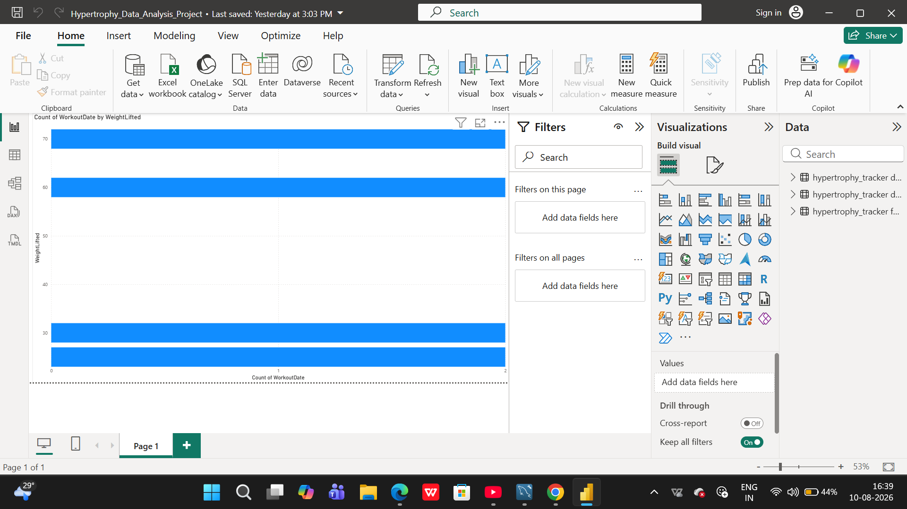

# Hypertrophy Tracker: SQL-Driven Workout Analytics Dashboard

## Project Overview
The **Hypertrophy Tracker** is an end-to-end data analytics pipeline designed to track, store, and visualize longitudinal fitness data. By engineering a local MySQL database and establishing a direct connection to Microsoft Power BI, this project transforms raw workout logs into actionable insights regarding progressive overload, training volume, and muscle group targeting.

## Key Features & Analytics
*   **Volume Tracking:** Utilizes DAX measures to calculate and visualize total volume moved (`Sets * Reps * WeightLifted`) across specific muscle groups (specifically Back and Biceps).
*   **Methodology Comparison:** Evaluates the long-term effectiveness of high-volume versus low-volume training protocols through visual data representations.
*   **Progressive Overload:** Tracks top-end strength progression and weekly volume trends to extract actionable insights for performance optimization.
*   **Dynamic Data Pipeline:** Establishes a direct connection from a local database to Power BI, enabling seamless data modeling and reporting.

## Technology Stack
*   **Database:** MySQL, SQL (DDL/DML)
*   **Business Intelligence & Visualization:** Microsoft Power BI
*   **Languages & Concepts:** DAX (Data Analysis Expressions), Relational Data Modeling, ETL Processes
*   **Data Source / Manipulation:** Excel

## Database Schema
The relational database is structured to optimize querying for Power BI:
*   **`dim_workouts`**: A dimension table categorizing workout session types, dates, and durations.
*   **`fact_workoutsets`**: A fact table recording the transactional data of each training session, logging `RepsCompleted`, `WeightLifted`, `ExerciseID`, and target muscle groups.

## Visualizations
*(Add screenshots of your Power BI dashboard here to showcase your work)*


*Description: Clustered bar charts and trend lines illustrating total volume moved by muscle group.*

## How to Run Locally
1. Clone this repository to your local machine:
   ```bash
   git clone [https://github.com/Krish-8208971331/sql-hypertrophy-analytics.git](https://github.com/Krish-8208971331/sql-hypertrophy-analytics.git)
